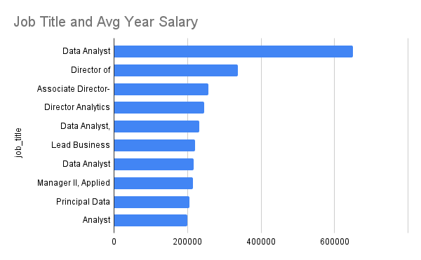
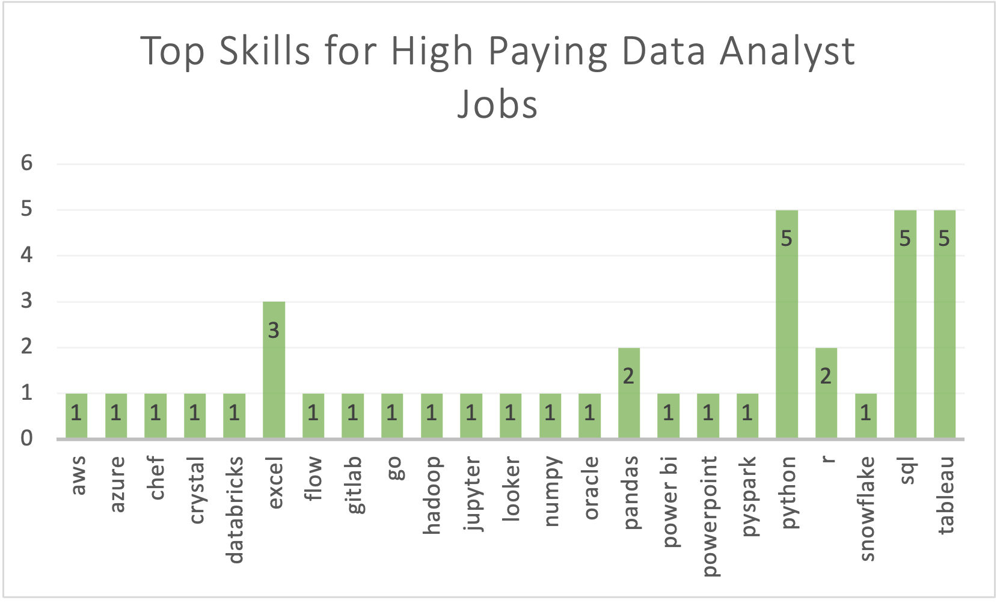

# Introduction

📈 Let's check out the data job market! Focusing on Business and Data Analyst roles, this project takes a deeper dive into job postings from 2023. We'll explore 💰 high-salary jobs, 🔥 in-demand skills, and 🌎 how to optimize the job search in this ever-changing world.

🔎 SQL Queries? Check them out here: [project_sql_folder](/project_sql/)

# Backgound

As I have a background in e-commerce, I wanted to explore more oppurtunities in the data world that would apply to my skill set. On my quest to better understand SQL, I came acrosss 📚[Luke Barousse's SQL Course](https://youtu.be/7mz73uXD9DA?si=HshQubg7HKKhw2fi) on Youtube where I aquired the dataset for this project.

The data consists of international information on job postings in the data world including:

- Job Location
- Job Titles
- Salaries
- Essential Skills
- and many more 😄

### Our goal was to use SQL queries to answer the following questions

1. What are the top-paying Data Analyst roles from 2023?
2. What skills are required for the top paying Business/Data Analyst roles?
3. What are the most in-demand skills for Business/Data Analyst roles?
4. What are the top skills based on salary?
5. What are the most optimal skills to learn (high-paying AND in-demand)?

# Tools I Used

- **SQL:** The backbone of my analysis, allowing me to query and glean insight from the data
- **PostgreSQL:** The chosen database management source, it's a common and powerful relational database system
- **Excel/Google Sheets:** My main source for visualizations and advanced querying
- **Visual Studio Code:** My essential IDE for most of my coding projects
- **Git & Github:** A perfect place to share my code with others as well as maintain version control

# The Analysis

Each query in the project investigated a different issue or aspect of the job market. Here's how I approached each question:

### Top Highest Paying Jobs for Data Analysts (Locally/Remote)

First, I filtered jobs by yearly salary, focusing on remote and local (Georgia in this case) locations.This query highlights the top-paying oppurtunities for Data Analysts, which offers insight into what skills are trending in the industry.

```sql
SELECT
  job_id,
  job_title,
  job_location,
  job_schedule_type,
  salary_year_avg,
  job_posted_date,
  name AS company_name
FROM
  job_postings_fact
  LEFT JOIN company_dim ON job_postings_fact.company_id = company_dim.company_id
WHERE
  job_title_short in ('Data Analyst', 'Business Analyst')
  AND salary_year_avg IS NOT NULL
  AND job_location in ('Anywhere', 'Atlanta, GA', 'Georgia')
ORDER BY
  salary_year_avg DESC
LIMIT
  10;
```

Here's the breakdown of the top data analyst jobs in 2023:

- **Wide Salary Range:** The top 10 salaries of data/business analyst roles in 2023 ranged from $200,000 to $650,000. This offers not only a wide range but a high base salary potential to job seekers.
- **Diverse Employers:** There are a variety of different companies to choose from including some well-known names like Uber, Pinterest, and AT&T.
- **Job Title Variety:** There's also a high-variety in job titles as Marketing Analyst, Senior Data Analyst and Director of Analytics are part of the list.



_This is a bar graph visualizing the results for the top 10 salaries for data analysts. I generated this graph using Google Sheets._

### Top Skills of High Paying Jobs for Data Analysts

Using the results from my first query as a CTE, I determined which skills these top paying jobs required. I used an inner join to ensure that I only captured jobs that had associated skills and vice versa.

```sql
WITH top_paying_jobs AS (
    SELECT
        job_id,
        job_title,
        job_location,
        job_schedule_type,
        salary_year_avg,
        job_posted_date::Date,
        name AS company_name
    FROM
        job_postings_fact
        LEFT JOIN company_dim ON job_postings_fact.company_id = company_dim.company_id
    WHERE
        job_title_short in ('Data Analyst', 'Business Analyst')
        AND salary_year_avg IS NOT NULL
        AND job_location in ('Anywhere', 'Atlanta, GA', 'Georgia')
    ORDER BY
        salary_year_avg DESC
    LIMIT
        10
)
SELECT
    top_paying_jobs.*,
    skills
FROM top_paying_jobs
JOIN skills_job_dim ON top_paying_jobs.job_id = skills_job_dim.job_id
JOIN skills_dim ON skills_job_dim.skill_id = skills_dim.skill_id
ORDER BY salary_year_avg
;
```

The Breakdown:

- **Variety of Skill Range:** There were 39 different skills between the variety of jobs so data analysts aren't limited in technological oppurtinuties skill-wise
- **High Frequency of Specific Skills:** According to the graph below, **Python**, **SQL**, and **Tableau** are equally the most common skills amongst high-paying jobs with **Excel** as a close second.



_This is a bar graph of the different skills associated with high-paying jobs as well as their frequency._

### Most In-Demand Skills for Data Analysts

While it's important to know the skills required to find a high-paying job, these roles tend to go to more senior job-seekers.

By exploring the overall demand for certain skills, I'll get a more comprehensive view of skill requirements for data analysts.

This can be done by joining the skills to their appropriate job postings and then finding the top 5 skills by count.

```sql
SELECT
  skills,
  COUNT(skills_job_dim.job_id) AS demand_count
FROM
  job_postings_fact
  JOIN skills_job_dim ON job_postings_fact.job_id = skills_job_dim.job_id
  JOIN skills_dim ON skills_job_dim.skill_id = skills_dim.skill_id
WHERE
  job_title_short IN ('Business Analyst', 'Data Analyst')
  AND job_location IN ('Anywhere', 'Atlanta, GA', 'Georgia')
GROUP BY
  skills
ORDER BY
  demand_count DESC
LIMIT
  5;
```

Here's the breakdown of the top 5 skills for data analysts in 2023:

- **Importance of SQL:** SQL came up in over 10,000 job postings in 2023. We can safely say that learning the #1 skill through projects like these will help job-seekers
- **Top skills are robust to salary:** When comparing the top skills of high paying jobs against the rest of the sample, we can see many of the same values including: **Excel, Python, and Tableau**

### In-Demand Skills Table

|   Skills | Demand Count |
| -------: | :----------: |
|      sql |    10325     |
|    excel |     6886     |
|   python |     5787     |
|  tableau |     5484     |
| power bi |     3808     |

_A table of the top 5 most in-demand skills for data analysts in 2023._

### Top Paying Skills for Remote Business/Data Analyst Jobs

My goal is to work remotely so I also took a look at skills required for the highest paying remote jobs.

By joining the skills table to the job postings table, I was able to sort the skills by highest salary and remote availability.

```sql
SELECT
    skills,
    ROUND(AVG(salary_year_avg),0) AS avg_salary
FROM
    job_postings_fact
    JOIN skills_job_dim ON job_postings_fact.job_id = skills_job_dim.job_id
    JOIN skills_dim ON skills_job_dim.skill_id = skills_dim.skill_id
WHERE
    job_title_short in ('Business Analyst', 'Data Analyst')
    AND salary_year_avg IS NOT NULL
    AND job_work_from_home = True
GROUP BY
    skills
ORDER BY
    avg_salary DESC
LIMIT
    25;
```

The breakdown of top paying skills for data analysts:

- **Speciliazed Skills:** When doing research on some of the top skills listed, I found many of them to be for Machine Learning and Big Data such as **Pyspark, Bitbucket, and Watson**. Considering a specialized field to work in can improve financial stability for job-seekers.
- **Financial Security:** Out of the top 25 skills,the highest paying skill has an average yearly salary of $208,172 with the lowest being $114,158. Learning any of the skills on this list will increase financial oppurtunites.

### Top 10 Highest Paying Skills Table

|    Skills | Avg Salary by Year |
| --------: | :----------------: |
|   pyspark |      $208,172      |
| bitbucket |      $189,155      |
|    watson |      $160,515      |
| couchbase |      $160,515      |
| datarobot |      $155,486      |
|    gitlab |      $154,500      |
|     swift |      $153,750      |
|   jupyter |      $152,777      |
|      chef |      $152,500      |
|    pandas |      $151,821      |

_A table showing the top 10 highest paying skills for remote data analysts._

### Top Optimal Job Skills for Business/Data Analysts

To round out my analysis, I needed to find the skills that are not only the most in-demannd but also offer the highest pay.

I created 2 CTEs, one with jobs with highest salaries and one with jobs with the most in-demand skills. From there, I was able to sort by demand and then by salary. I chose to sort by demand first so that we can hit as many entries as possible.

```sql
WITH in_demand_skills AS (
    SELECT
        skills_dim.skills,
        skills_dim.skill_id,
        COUNT(skills_job_dim.job_id) AS demand_count
    FROM
        job_postings_fact
        JOIN skills_job_dim ON job_postings_fact.job_id = skills_job_dim.job_id
        JOIN skills_dim ON skills_job_dim.skill_id = skills_dim.skill_id
    WHERE
        job_title_short in ('Business Analyst', 'Data Analyst')
        AND salary_year_avg IS NOT NULL
        AND job_work_from_home = True
    GROUP BY
        skills_dim.skill_id
),
average_salary AS (
    SELECT
        skills_job_dim.skill_id,
        ROUND(AVG(salary_year_avg), 0) AS avg_salary
    FROM
        job_postings_fact
        JOIN skills_job_dim ON job_postings_fact.job_id = skills_job_dim.job_id
        JOIN skills_dim ON skills_job_dim.skill_id = skills_dim.skill_id
    WHERE
        job_title_short in ('Business Analyst', 'Data Analyst')
        AND salary_year_avg IS NOT NULL
        AND job_work_from_home = True
    GROUP BY
        skills_job_dim.skill_id
)
SELECT
    in_demand_skills.skill_id,
    in_demand_skills.skills,
    demand_count,
    avg_salary
FROM
    in_demand_skills
    JOIN average_salary ON in_demand_skills.skill_id = average_salary.skill_id
WHERE
    demand_count > 10
ORDER BY
    demand_count DESC,
    avg_salary DESC
LIMIT
    25;
```

The breakdown of the most optimal skills for data analysts:

- **Consistency:** SQL has been #1 for both highest average salary and most in-demand skill. Across each query, this has remained true.
- **Demand for variety of skills:** We can see that in order to earn the most money, you also need to have a large variety of skills.
  Some of these skills include data manipulation like **Excel** and data visualization like **Tableau and Power BI**.

### Top 10 Optimal Skills Table

|     Skills | Demand Count | Avg Salary by Year |
| ---------: | :----------: | :----------------: |
|        sql |     440      |      $97,417       |
|      excel |     287      |      $88,027       |
|    tableau |     257      |      $99,807       |
|     python |     256      |      $102,578      |
|          r |     156      |      $101,223      |
|   power bi |     122      |      $96,744       |
|        sas |      70      |      $98,908       |
| powerpoint |      63      |      $89,661       |
|     looker |      54      |      $106,259      |
|       word |      52      |      $84,012       |

_A table detailing the demand count and average salary by skill._

# What I Learned
Throughout this journey, I've gained a much deeper understanding of SQL and its importance. Here are a few takeaways from this project:
- **🧩 Complex Query Crafting:** I improved my SQL skills by using techniques like CTEs and JOINs to perform complex querying.
- **📊 Data Aggregation:** I got more comfortable with aggregate functions such as COUNT() and AVG() and sorting through the results with GROUP BY clauses.
- **🔎 Analytical Mindset:** I honed my problem solving skills in emulating what I'd see in the workplace by using real-world data.

# Conclusions

